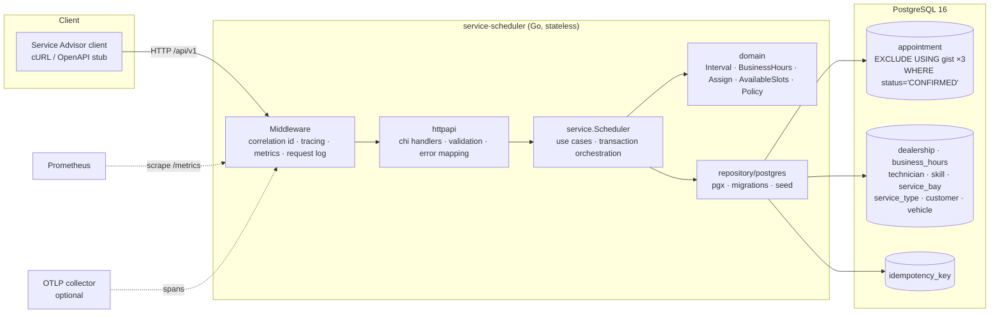
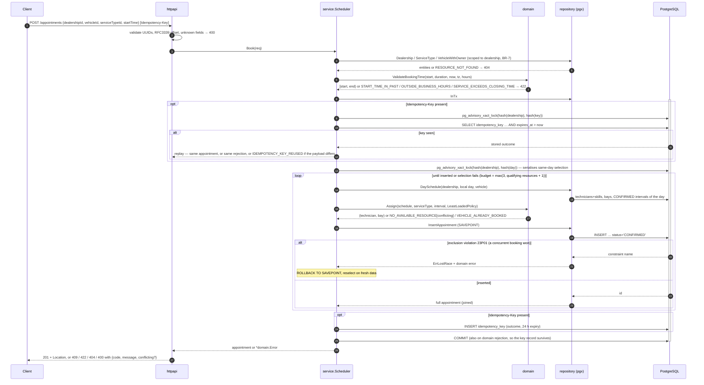
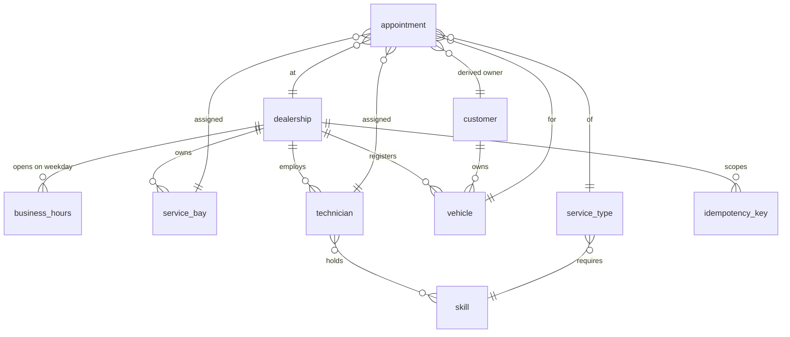

# System design — Unified Service Scheduler

Companion to [`requirements.md`](./requirements.md) (the *what*). This document is the *how*.
Decision records with alternatives live in [`adr/`](./adr/).

## 1. Architecture

### Component roles

| Component | Responsibility | Must not |
|---|---|---|
| `internal/httpapi` | Parse and validate syntax, forward `Idempotency-Key`, map `*domain.Error` to §10 status codes, render timestamps in the dealership offset | Contain business rules |
| `internal/service` | Implement FR-1..FR-4: look up references, validate time (BR-4/5), run the booking transaction, retry on lost races, replay idempotent requests, emit metrics and spans | Contain SQL or HTTP types |
| `internal/domain` | Pure rules: half-open intervals, business-hour windows, qualification (BR-2/3), least-loaded policy (BR-6), assignment, availability slots. No I/O | Know about the database or HTTP |
| `internal/repository/postgres` | Data access only: load one dealership's resources and the day's CONFIRMED intervals, insert inside a savepoint, translate constraint violations, idempotency rows, embedded migrations and seed | Decide which candidate wins |
| `internal/observability` | JSON logs with correlation/trace ids, Prometheus instruments, OTel provider and middleware | — |
| PostgreSQL | **The correctness guarantee** for INV-1..INV-3 (exclusion constraints), INV-4/INV-5 and INV-7 (composite foreign keys) | — |

The dependency direction is strictly inward: `httpapi → service → domain`, `postgres → service (ports) → domain`.
Ports (`service.Repository`, `service.BookingTx`, `httpapi.Service`, `service.Instrumentation`) are declared
by their consumers, so every layer is testable with fakes and the database is swapped in only for
integration tests.

## 2. Data flow — `POST /api/v1/appointments`

Key properties of this flow:

* **Atomicity** — one transaction covers selection, insert and idempotency record. Either a
  CONFIRMED row that satisfies every invariant exists, or nothing is written except (optionally)
  the record of the rejection.
* **Concurrency** — application checks never guard correctness. Overlapping rows for the same
  bay/technician/vehicle are impossible because of the exclusion constraints. Selection for one
  dealership-day is additionally serialised by a transaction advisory lock so competitors decide one
  after another on committed data instead of deadlocking on the constraint check (`40P01`, observed
  on CI) and re-picking the same resource; if a race is still lost (`23P01`/`40P01`) the service
  re-selects on fresh data. AC-18 is tested with 20 goroutines; a four-bay variant proves no
  spurious rejection.
* **Determinism** — BR-6 is a pure function of the day's schedule; identical inputs give identical
  assignments (AC-21), which is also why the lost-race retry is needed (all competitors pick the
  same "best" resource first).

### `GET /api/v1/availability`

Same building blocks, no transaction: resolve the day window in the dealership's zone → load the day
schedule including the requested vehicle's confirmed intervals (`vehicleId` is required) →
`domain.AvailableSlots` walks 30-minute steps and keeps those where `Assign` would succeed for that
vehicle and the job ends by closing. Because it reuses `Assign`, FR-1 and FR-2 cannot disagree
except through staleness, which the spec accepts ("advisory").

## 3. Data model

* `appointment(start_time, end_time)` are `timestamptz`; three partial exclusion constraints on
  `tstzrange(start_time, end_time, '[)')` per `bay_id`, `technician_id`, `vehicle_id` with
  `WHERE status = 'CONFIRMED'` (INV-1..3, BR-9, A-5).
* Composite foreign keys `(technician_id, dealership_id)` etc. enforce INV-7 in the database.
* `business_hours(weekday 0=Sunday…6, opens_at time, closes_at time)`; no row = closed.
* `idempotency_key(dealership_id, key)` PK; stores the *outcome* (appointment id or error code +
  conflicting), `expires_at = created + 24 h`.
* INV-4/INV-5 (skill and bay type match) are enforced by the domain candidate filter *and*, since
  migration 0002, by composite foreign keys: `appointment.required_skill_id / required_bay_type`
  are pinned to the service type, and `(technician_id, required_skill_id) → technician_skill`,
  `(bay_id, required_bay_type) → service_bay(id, bay_type)` reject unqualified assignments.

## 4. Technology choices

| Choice | Why | Considered instead |
|---|---|---|
| Go 1.25, stdlib `net/http` + **chi** | Small, idiomatic router with route patterns (needed for low-cardinality metrics/spans) and standard middleware signature | gin/echo (heavier, own context types); stdlib mux (no route pattern for params until 1.22 and still no middleware chain) |
| **pgx v5**, no ORM | Direct control over SQL, savepoints, SQLSTATE/constraint names, `pgtype`; ORMs hide exactly the things this problem is about | GORM/ent (constraint-name mapping and exclusion constraints awkward) |
| **PostgreSQL 16** with `btree_gist` | Exclusion constraints on ranges are the only declarative, race-free way to state INV-1..3 | MySQL (no exclusion constraints → application locks) |
| Embedded SQL migrations (~60 lines of Go) | One binary, no extra tool, advisory-locked so replicas can start together | golang-migrate / goose (fine, but a dependency for one file) |
| **testcontainers-go** | Integration tests run against a real Postgres 16 with the real constraints; `-short` skips them | sqlite/in-memory fakes (would not exercise the guarantee) |
| `log/slog` JSON | Stdlib structured logging; a 30-line handler adds correlation/trace ids | zap/zerolog (faster, unnecessary here) |
| **prometheus/client_golang** | De-facto metrics format; counters/histograms exactly as §11 lists | OpenTelemetry metrics (less mature scrape story) |
| **OpenTelemetry** SDK + OTLP/HTTP | Vendor-neutral spans across handler → policy → persistence; export is opt-in by env var | Jaeger client (deprecated) |
| Hand-written validation | Three endpoints; a `details` map per field is clearer than tag-driven validators | go-playground/validator |
| Distroless runtime image, compose healthcheck | Small image; app starts only after Postgres is ready and migrates/seeds itself | Separate migrate job |

Dependency list (direct): chi, pgx, testcontainers-go (+ postgres module), prometheus client, otel
(api, sdk, trace, otlptracehttp). Everything else is stdlib.

## 5. Observability strategy

| Signal | What | Where |
|---|---|---|
| Logs | JSON, one line per request (`method`, `path`, `status`, `bytes`, `duration_ms`) and application events; every record carries `correlation_id`, `trace_id`, `span_id` when in a request context | `internal/observability/logging.go` |
| Correlation | `X-Correlation-ID` reused from the client or generated (128-bit hex), echoed on every response, attached to the server span | `CorrelationMiddleware` |
| Metrics | `scheduler_bookings_attempted_total`, `scheduler_bookings_confirmed_total`, `scheduler_bookings_rejected_total{reason}`, `scheduler_booking_duration_seconds` (booking path), `http_server_request_duration_seconds{method,route,status}`, `http_server_requests_in_flight`, Go/process collectors; scraped at `/metrics` | `internal/observability/metrics.go`, `service.Instrumentation` port |
| Traces | `POST /api/v1/appointments` (SERVER) → `scheduler.Book` → `repository.Transaction` → `repository.DaySchedule` → `policy.Assign` (per attempt, with candidate counts, chosen ids, outcome) → `repository.InsertAppointment` (`lost_race` attribute when the DB rejected). W3C `traceparent` honoured | `internal/observability/tracing.go`, spans in service and repository |
| Health | `GET /healthz` (liveness) and `GET /readyz` (readiness: database ping) | router |

What you would alert on: rejected-by-reason rate spikes (capacity or data problem), p95 of
`scheduler_booking_duration_seconds` against the 200 ms NFR, 5xx rate, and `lost_race` frequency in
traces (contention on a single resource).

## 6. Scaling and operations

The service is stateless; any number of replicas can run against one database because the
invariants live in the database. Bookings for the same dealership-day are serialised by an advisory
lock (milliseconds each); other days and dealerships proceed in parallel. That is the intended
bottleneck: a workshop day is booked one decision at a time. Availability queries are read-only and served by the partial index
`appointment_dealership_day_idx (dealership_id, start_time) WHERE status='CONFIRMED'`.

Not implemented (out of scope per §5.2 or deferred): expired idempotency-key purge, cancellation
endpoint (the status column and constraints already support it), technician shifts, multi-tenancy
scoping beyond `dealership_id` on every query.

## 7. GenAI use during design

`requirements.md` was written by the engineer before any code and is the input to the whole build;
everything downstream of it was designed and implemented with an AI coding agent (Claude) working
from that specification. What the model contributed and where it was kept in check:

* **Where GenAI was used** — turning the FR/BR/INV/AC lists into a package layout, a schema, test
  cases named after acceptance criteria, the transaction protocol (idempotency-key lock →
  per-dealership-day lock → select → savepoint insert → retry), the observability wiring, and every
  document in this repository except `requirements.md`. Commit granularity and
  test-before-implementation ordering were also produced by the agent.
* **Where it needed judgement calls** the specification did not make — slot granularity (30 min),
  a required `vehicleId` on availability (added after human review so INV-3 is always applied),
  error precedence (the agent originally checked the vehicle first; changed at review so resource
  conflicts are reported ahead of the vehicle conflict and AC-18 holds literally — identical
  concurrent requests for the last slot all receive `NO_AVAILABLE_RESOURCE`; past still precedes
  hours), the flat error body, strict JSON
  (unknown fields rejected), 404 for malformed path ids, storing rejections under idempotency keys,
  and the retry-on-lost-race behaviour. Each is recorded, with the reasoning and the counter-argument, in
  [`ai-collaboration-raw.md`](./ai-collaboration-raw.md) so a human can overturn it deliberately.
* **Where it was wrong** — the OpenTelemetry resource construction crashed the service on start-up
  inside docker compose (schema-URL conflict). Unit tests had not covered that path; the running
  stack exposed it, a failing test was added, then the fix. One test compared structs containing
  slices. Both are logged.
* **What a human still has to check** — the list in [`risk-areas.md`](./risk-areas.md): the three
  constraints, the transaction and its retry budget, error precedence, idempotency semantics, the
  RESTRICT cost of the INV-4/INV-5 foreign keys (decertifying a technician or retyping a bay is
  blocked while any appointment references the old value — risk item 8), and DST behaviour, which
  is reasoned about but untested because the seeded zone has none (risk item 7).
* **Method** — spec as the single source of truth, acceptance-criteria-named tests written and
  committed before implementation, a real database in tests rather than mocks for anything touching
  the constraints, and a running log written after each phase rather than a retrospective.
